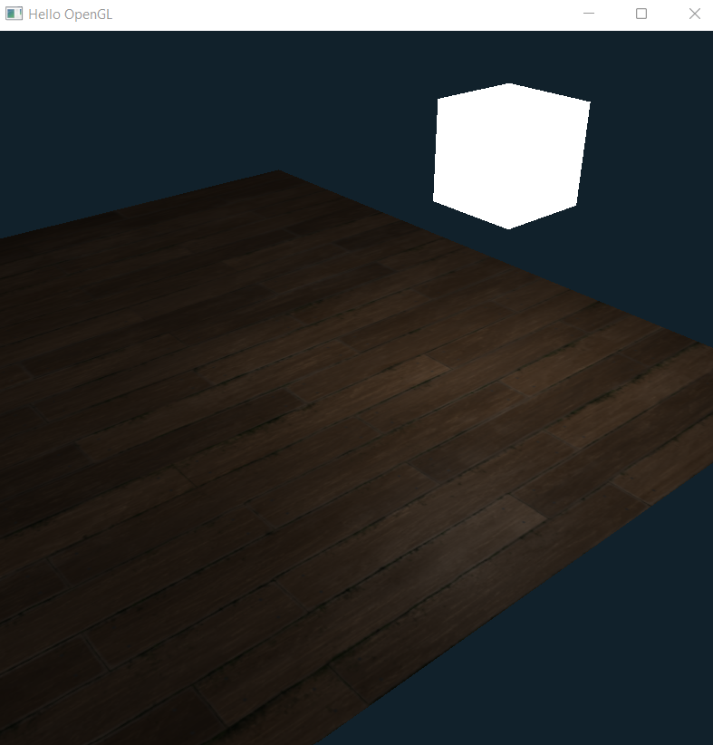
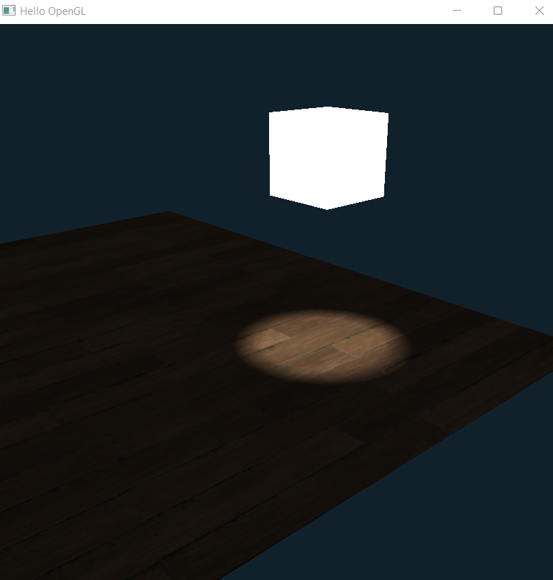

# Hello OpenGL

This is my first ever OpenGL project, based on this tutorial serires on YouTube (<a href = "https://www.youtube.com/watch?v=45MIykWJ-C4">link</a>). This project I implemented a 3D camera, Texture Loading, Specular Mapping and three type of lightning (point, directional, spot). 
I am not finished this project because I started learning the whole thing again from the ground up. I usded GLFW for window handaling, and glm for the math. 

# Screen Shots

 
 
